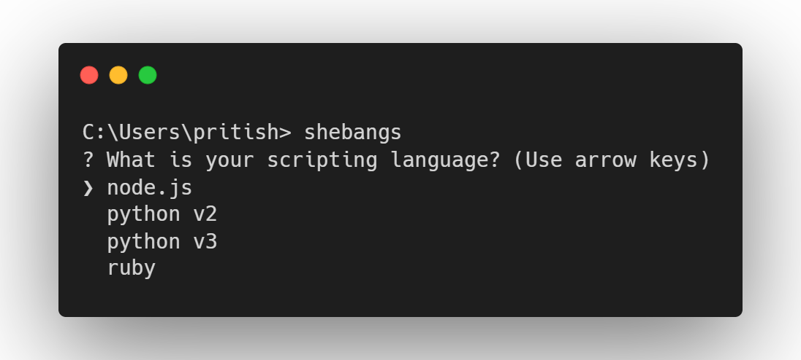

<h1 align="center">add-shebangs</h1> 

<div align ="center">

[](https://www.npmjs.com/package/add-shebangs)

</div>
<p align="center">a simple CLI tool that adds a shebang command to your file </p> 

## Install
```
npm install -global add-shebangs
```

## Usage
```
shebangs
```

## Features to be added

- adds bin field  to `package.json`
    - ask the user for the execute command 
- support more languages
